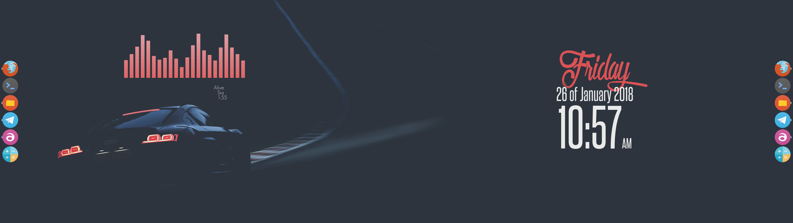

# Dark Car

## Basics
__I'm not allowed to post the wallpaper image here, have a look at the [Gary a.k.a MoMo P-Zero](https://www.flickr.com/photos/thevenommob/16793942975/) awesome work. You can download it and edit it with any image editor to make it look as mine.__ The right photo, almost everything is a flat color that matches the left background, that makes it feel like the original photo was shot like this.

## Special software
This software is not mentioned at [general guide](../README.md) and will be used in this setup:
* [NumixCircle](https://aur.archlinux.org/packages/numix-circle-icon-theme-git/) - Icon theme(for cairo dock)
* [Audacious](https://wiki.archlinux.org/index.php/audacious) - Music player(__conky will display music information just if you're using audacious__)
* [Cava](https://aur.archlinux.org/packages/cava/) - Audio visualizer for terminal
* [Tilda](https://wiki.archlinux.org/index.php/Tilda) - Transparent terminal
* Some Fonts - Olympic Branding and Geosanslight(used in conky)

## Let's do it
What we'll need to do is to install all these software and replace the specified configuration files of each tool with the files on the repo. There are a few steps:
* `Openbox`: Replace `~/.config/openbox` file with [this file](autostart). But hey, if you have a look at the file, you'll find that there are some paths that must be changed to where you place the other files we'll be mentioning.

* `CairoDock`: We'll have two docks; one at the very left of the screen, and other at the very right. Each dock has different configuration, so you need to move both [config1](CairoDock/cairo-dock1.zip) and [config2](CairoDock/cairo-dock2.zip) zips to `~/.config` and decompress them, which will generate two folders. Cairo will use [numix circle icon theme](https://aur.archlinux.org/packages/numix-circle-icon-theme-git/), so you should install it. If you need to set other path or you installed the icon pack but the icons are not working properly, you can modify the path under cairo dock configuration.

* `Conky`: This will show the [date](Conky/Date) and the [music](Conky/Music) information, which are in different files. You can save those files where you prefer. Note that the music conky displays information about the music playing just if you're using audacious music player!

* `Tilda`: Tilda is a terminal which can be configured to be transparent. Inside it, we'll run cava, which will display the visualizer of the music currently playing. The [tilda configuration](tilda) just makes it transparent, which does not work flawlessly. That's why I wrote 99 at level of transparency(under appearence/extras)instead of 100, which didn't work for me. Also changed the background color to match de wallpaper color. This must be saved as `~/.config/tilda/config_0`

* `Cava` : This [configuration](cava) is really tiny. I just changed bar colours a bit to match the car's light color. This must be saved as `~/.config/cava/config`

* `Mixing all together`: Finally, we need all stuff to start at boot, for what we are gonna use openbox autostart file, mentioned above.

      feh --bg-fill /path/to/audi1.jpg --bg-fill /path/to/audi2.jpg
      compton -CGb
      cairo-dock -o -d /path/to/cairo-dock1 &
      cairo-dock -o -d /path/to/cairo-dock2 &
      sleep 5
      conky -q -c /path/to/ConkyDate &
      conky -q -c /path/to/ConkyMusic &
      sleep 1
      tilda &

You'll need to change the path for feh, caido-dock and conky(where you have each configuration file).feh will set the wallpaper on both screens(you need to edit the original image). Compton will allow transparency and other stuff, we're running it as a daemon. We start cairo and sleep a few seconds to launch conky properly. Finally we launch tilda, which configuration will tell to launch cava. We're all set!

## Troubleshooting
If you are using pulseaudio, and you run cava but bars are not moving, althougt music is playing, it may be problem of your pulseaudio configuration. This could happen if you change your audio cable from one source to another. This happened to me and what I did to solve it was running pulseaudio volume control(in arch, pavucontrol)Then, in configuration, I had two output devices, the one I was using and other dummy output(Built-in Audio)The problem is that cava is getting sound from the dummy output instead of the actual output, so you only need to disable the dummy output.
