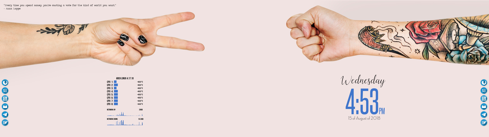

# Light Hands

## Basics
For general basic configuration, please read [general guide](../README.md). __I'm not allowed to post the wallpaper image here, have a look at the [rawpixel](https://www.rawpixel.com/image/379549/hand-holding-variation-object) original image or at [pexels](https://www.pexels.com/photo/person-with-tattoo-playing-paper-scissor-and-stone-1249214/). You can download it and edit it with any image editor to make it look as mine.__ Just divide both hands and increase the distance between them, and place them a bit higher.

## Special software
This software/tools are not mentioned at [general guide](../README.md) and will be used in this setup:
* [Sardi Flexible](https://sourceforge.net/projects/sardi/) - Icon theme from Sardi pack(for cairo dock)
* [Lua file](Conky/bars.lua) - Lua code to show fancy bars. __NOTE: This script was made by [wlourf](http://u-scripts.blogspot.com/2010/07/bargraph-widget.html)__, I just modified it to make it match my needs.
* [Quoute script](/quote.sh) - Bash script to fetch random quote from the network.

## Let's do it
Install `Sardi` icon pack and replace the specified configuration files of each tool with the files on the repo. There are a few steps:

* `CairoDock`: We'll have two docks; one at the very left of the screen, and other at the very right. If you need to set other path or you installed the icon pack but the icons are not working properly, you can modify the path under cairo dock configuration.

* `Conky`: This will show the [date](Conky/date.conky), the [quote](Conky/quote.conky) and the [resources](Conky/resources.conky) information, which are in different files. __Note that the [quote.conky](Conky/quote.conky) needs the [quote script](quote.sh) to work, so you need to modify it path, which is described in [quote.conky](Conky/quote.conky). Note also that the resources conky needs the [bars.lua](Conky/bars.lua) script to work, so you need to modify it path, which is described in [bars.conky](Conky/bars.conky).__

* `Mixing all together`: Finally, we need all stuff to start at boot, for what we could use my [autoconfigure](../autoconfigure.sh), or the openbox autostart file, mentioned above, which is a easier approach:

      feh --bg-fill /path/to/wall1.jpg --bg-fill /path/to/wall2.jpg
      compton -CGb
      cairo-dock -o -d /path/to/cairo-dock1 &
      cairo-dock -o -d /path/to/cairo-dock2 &
      conky -q -c /path/to/date.conky &
      conky -q -c /path/to/quote.conky &
      conky -q -c /path/to/resources.conky &
