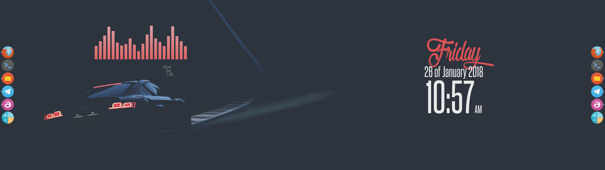

# Dual-Screen Linux Customization
This is a collection of fancy dual screen Linux setups, customized with some different kind of tools and software. Each folder contains a different customization, which can be shown in the image and applied by means of the configuration files provided. Here follows a generic guide to apply a typical customization(however, each setup could be different in some point from this approach) and a basic introduction to every tool:

## Basics
Although I'm working(and testing) this on ArchLinux, this should work for any distro. However, I'll be referencing some ArchLinux stuff when needed, but it must be an equivalent for any other distro. __NOTE: I will not be posting original wallpapers here, instead, I'll be referencing original work with a link__

## Sofware and stuff
At a global scope, this is the software and tools that will be used:

#### Compositioning and windows:
- [Openbox](https://wiki.archlinux.org/index.php/openbox) - The window manager: When openbox is started(eg, when linux ends booting up), it will run file located at `~/.config/openbox/autostart`. If you set your commands here, they will be run every time openbox starts.
- [Compton](https://wiki.archlinux.org/index.php/Compton) - The compositor: Common way to run it is `compton -CGb`. You should place this on openbox autostart file mentioned above, and you allways will have compton running.

#### Customization software
- [CairoDock](https://wiki.archlinux.org/index.php/Cairo-Dock) - Clean dock for apps: Cairo dock configuration files are distributed as directories with several files in them. To apply it, run `cairo-dock -d dir`. In this page you will have cairo dock directories packaged in zip files, so decompress them first and run cairo dock after that.
- [Conky](https://www.archlinux.org/packages/extra/x86_64/conky/) -  System monitor for X: With conky you will be able to display a big variety of stuff over your desktop. This configuration files are distributed as `conkyrc` files, and can be applied by running `conky -c conkyrc`.
- [Feh](https://wiki.archlinux.org/index.php/feh) - Setting desktop background: Although this tool is usually used to open images, it's such a nice utility to set desktop backgrounds. You can use it dual screen setup, using a different image for each screen with `feh --bg-fill left-image.jpg --bg-fill right-image.jpg`

## Other recomendations
In my setups(openbox) I generally use [Arc-Dark](https://www.archlinux.org/packages/community/any/arc-gtk-theme) as `Gtk-Theme`, and my own [Arc-Dark-OSX](https://github.com/Dr-Noob/Arc-Dark-OSX) as `Window border`.

You could download and prepare more than a theme and apply them dinamically with [autoconfigure](/autoconfigure.sh), which is a script to automatically switch between themes. The proper way to use it by running it from openbox autostart file and modifying it with proper paths.

## Some examples

__Dark_Car__ theme

__Dark_Space__ theme

__Light_Hands__ theme

__Light_Landscape__ theme

